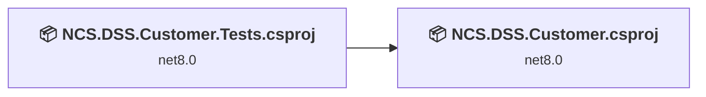
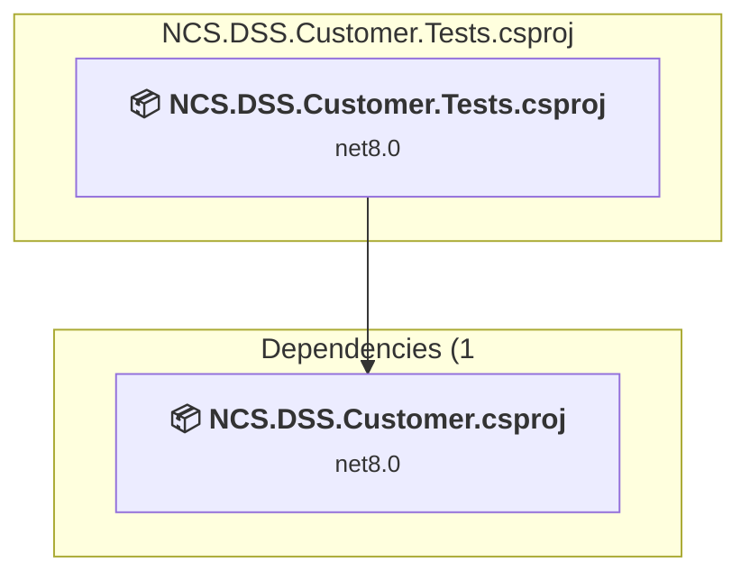
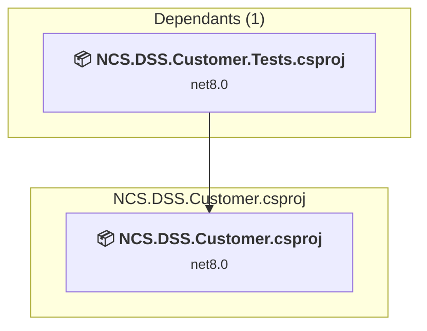

# Projects and dependencies analysis

This document provides a comprehensive overview of the projects and their dependencies in the context of upgrading to .NETCoreApp,Version=v10.0.

## Table of Contents

- [Executive Summary](#executive-Summary)
  - [Highlevel Metrics](#highlevel-metrics)
  - [Projects Compatibility](#projects-compatibility)
  - [Package Compatibility](#package-compatibility)
  - [API Compatibility](#api-compatibility)
- [Aggregate NuGet packages details](#aggregate-nuget-packages-details)
- [Top API Migration Challenges](#top-api-migration-challenges)
  - [Technologies and Features](#technologies-and-features)
  - [Most Frequent API Issues](#most-frequent-api-issues)
- [Projects Relationship Graph](#projects-relationship-graph)
- [Project Details](#project-details)

  - [NCS.DSS.Customer.Tests\NCS.DSS.Customer.Tests.csproj](#ncsdsscustomertestsncsdsscustomertestscsproj)
  - [NCS.DSS.Customer\NCS.DSS.Customer.csproj](#ncsdsscustomerncsdsscustomercsproj)

## Executive Summary

### Highlevel Metrics

| Metric | Count | Status |
| :--- | :---: | :--- |
| Total Projects | 2 | All require upgrade |
| Total NuGet Packages | 22 | 9 need upgrade |
| Total Code Files | 46 |  |
| Total Code Files with Incidents | 4 |  |
| Total Lines of Code | 3803 |  |
| Total Number of Issues | 17 |  |
| Estimated LOC to modify | 3+ | at least 0.1% of codebase |

### Projects Compatibility

| Project | Target Framework | Difficulty | Package Issues | API Issues | Est. LOC Impact | Description |
| :--- | :---: | :---: | :---: | :---: | :---: | :--- |
| [NCS.DSS.Customer.Tests\NCS.DSS.Customer.Tests.csproj](#ncsdsscustomertestsncsdsscustomertestscsproj) | net8.0 | 🟢 Low | 1 | 0 |  | DotNetCoreApp, Sdk Style = True |
| [NCS.DSS.Customer\NCS.DSS.Customer.csproj](#ncsdsscustomerncsdsscustomercsproj) | net8.0 | 🟢 Low | 10 | 3 | 3+ | AzureFunctions, Sdk Style = True |

### Package Compatibility

| Status | Count | Percentage |
| :--- | :---: | :---: |
| ✅ Compatible | 13 | 59.1% |
| ⚠️ Incompatible | 1 | 4.5% |
| 🔄 Upgrade Recommended | 8 | 36.4% |
| ***Total NuGet Packages*** | ***22*** | ***100%*** |

### API Compatibility

| Category | Count | Impact |
| :--- | :---: | :--- |
| 🔴 Binary Incompatible | 0 | High - Require code changes |
| 🟡 Source Incompatible | 0 | Medium - Needs re-compilation and potential conflicting API error fixing |
| 🔵 Behavioral change | 3 | Low - Behavioral changes that may require testing at runtime |
| ✅ Compatible | 6208 |  |
| ***Total APIs Analyzed*** | ***6211*** |  |

## Aggregate NuGet packages details

| Package | Current Version | Suggested Version | Projects | Description |
| :--- | :---: | :---: | :--- | :--- |
| Azure.Messaging.ServiceBus | 7.17.5 |  | [NCS.DSS.Customer.csproj](#ncsdsscustomerncsdsscustomercsproj) | ✅Compatible |
| Azure.Search.Documents | 11.5.1 |  | [NCS.DSS.Customer.csproj](#ncsdsscustomerncsdsscustomercsproj) [NCS.DSS.Customer.Tests.csproj](#ncsdsscustomertestsncsdsscustomertestscsproj) | ✅Compatible |
| DFC.Functions.DI.Standard | 0.1.0 |  | [NCS.DSS.Customer.Tests.csproj](#ncsdsscustomertestsncsdsscustomertestscsproj) | ✅Compatible |
| DFC.HTTP.Standard | 0.1.11 |  | [NCS.DSS.Customer.csproj](#ncsdsscustomerncsdsscustomercsproj) [NCS.DSS.Customer.Tests.csproj](#ncsdsscustomertestsncsdsscustomertestscsproj) | ✅Compatible |
| DFC.JSON.Standard | 0.1.4 |  | [NCS.DSS.Customer.csproj](#ncsdsscustomerncsdsscustomercsproj) [NCS.DSS.Customer.Tests.csproj](#ncsdsscustomertestsncsdsscustomertestscsproj) | ✅Compatible |
| DFC.Swagger.Standard | 0.1.36 |  | [NCS.DSS.Customer.csproj](#ncsdsscustomerncsdsscustomercsproj) | ✅Compatible |
| Microsoft.ApplicationInsights.WorkerService | 2.22.0 | 2.23.0 | [NCS.DSS.Customer.csproj](#ncsdsscustomerncsdsscustomercsproj) | NuGet package upgrade is recommended |
| Microsoft.Azure.Cosmos | 3.41.0 |  | [NCS.DSS.Customer.csproj](#ncsdsscustomerncsdsscustomercsproj) | ✅Compatible |
| Microsoft.Azure.Functions.Worker | 1.22.0 | 2.51.0 | [NCS.DSS.Customer.csproj](#ncsdsscustomerncsdsscustomercsproj) | NuGet package upgrade is recommended |
| Microsoft.Azure.Functions.Worker.ApplicationInsights | 2.0.0 | 2.50.0 | [NCS.DSS.Customer.csproj](#ncsdsscustomerncsdsscustomercsproj) | NuGet package upgrade is recommended |
| Microsoft.Azure.Functions.Worker.Extensions.CosmosDB | 3.0.9 | 4.14.0 | [NCS.DSS.Customer.csproj](#ncsdsscustomerncsdsscustomercsproj) | NuGet package upgrade is recommended |
| Microsoft.Azure.Functions.Worker.Extensions.Http | 3.2.0 | 3.3.0 | [NCS.DSS.Customer.csproj](#ncsdsscustomerncsdsscustomercsproj) | NuGet package upgrade is recommended |
| Microsoft.Azure.Functions.Worker.Extensions.Http.AspNetCore | 1.3.2 | 2.1.0 | [NCS.DSS.Customer.csproj](#ncsdsscustomerncsdsscustomercsproj) | NuGet package upgrade is recommended |
| Microsoft.Azure.Functions.Worker.Sdk | 1.17.4 | 2.0.7 | [NCS.DSS.Customer.csproj](#ncsdsscustomerncsdsscustomercsproj) | NuGet package upgrade is recommended |
| Microsoft.Azure.WebJobs.Extensions.CosmosDB | 4.7.0 |  | [NCS.DSS.Customer.Tests.csproj](#ncsdsscustomertestsncsdsscustomertestscsproj) | ✅Compatible |
| Microsoft.Extensions.DependencyInjection | 9.0.0 | 10.0.2 | [NCS.DSS.Customer.csproj](#ncsdsscustomerncsdsscustomercsproj) [NCS.DSS.Customer.Tests.csproj](#ncsdsscustomertestsncsdsscustomertestscsproj) | NuGet package upgrade is recommended |
| Microsoft.Identity.Client | 4.61.3 |  | [NCS.DSS.Customer.csproj](#ncsdsscustomerncsdsscustomercsproj) | ⚠️NuGet package is deprecated |
| Microsoft.NET.Test.Sdk | 17.10.0 |  | [NCS.DSS.Customer.Tests.csproj](#ncsdsscustomertestsncsdsscustomertestscsproj) | ✅Compatible |
| Moq | 4.20.70 |  | [NCS.DSS.Customer.Tests.csproj](#ncsdsscustomertestsncsdsscustomertestscsproj) | ✅Compatible |
| NUnit | 4.1.0 |  | [NCS.DSS.Customer.Tests.csproj](#ncsdsscustomertestsncsdsscustomertestscsproj) | ✅Compatible |
| NUnit3TestAdapter | 4.5.0 |  | [NCS.DSS.Customer.Tests.csproj](#ncsdsscustomertestsncsdsscustomertestscsproj) | ✅Compatible |
| System.Data.SqlClient | 4.8.6 |  | [NCS.DSS.Customer.csproj](#ncsdsscustomerncsdsscustomercsproj) [NCS.DSS.Customer.Tests.csproj](#ncsdsscustomertestsncsdsscustomertestscsproj) | ✅Compatible |

## Top API Migration Challenges

### Technologies and Features

| Technology | Issues | Percentage | Migration Path |
| :--- | :---: | :---: | :--- |

### Most Frequent API Issues

| API | Count | Percentage | Category |
| :--- | :---: | :---: | :--- |
| T:System.Uri | 1 | 33.3% | Behavioral Change |
| M:System.Uri.#ctor(System.String) | 1 | 33.3% | Behavioral Change |
| T:Microsoft.Extensions.Hosting.HostBuilder | 1 | 33.3% | Behavioral Change |

## Projects Relationship Graph

Legend:
📦 SDK-style project
⚙️ Classic project

## Project Details

### NCS.DSS.Customer.Tests\NCS.DSS.Customer.Tests.csproj

#### Project Info

- **Current Target Framework:** net8.0
- **Proposed Target Framework:** net10.0
- **SDK-style**: True
- **Project Kind:** DotNetCoreApp
- **Dependencies**: 1
- **Dependants**: 0
- **Number of Files**: 12
- **Number of Files with Incidents**: 1
- **Lines of Code**: 1674
- **Estimated LOC to modify**: 0+ (at least 0.0% of the project)

#### Dependency Graph

Legend:
📦 SDK-style project
⚙️ Classic project

### API Compatibility

| Category | Count | Impact |
| :--- | :---: | :--- |
| 🔴 Binary Incompatible | 0 | High - Require code changes |
| 🟡 Source Incompatible | 0 | Medium - Needs re-compilation and potential conflicting API error fixing |
| 🔵 Behavioral change | 0 | Low - Behavioral changes that may require testing at runtime |
| ✅ Compatible | 3198 |  |
| ***Total APIs Analyzed*** | ***3198*** |  |

### NCS.DSS.Customer\NCS.DSS.Customer.csproj

#### Project Info

- **Current Target Framework:** net8.0
- **Proposed Target Framework:** net10.0
- **SDK-style**: True
- **Project Kind:** AzureFunctions
- **Dependencies**: 0
- **Dependants**: 1
- **Number of Files**: 36
- **Number of Files with Incidents**: 3
- **Lines of Code**: 2129
- **Estimated LOC to modify**: 3+ (at least 0.1% of the project)

#### Dependency Graph

Legend:
📦 SDK-style project
⚙️ Classic project

### API Compatibility

| Category | Count | Impact |
| :--- | :---: | :--- |
| 🔴 Binary Incompatible | 0 | High - Require code changes |
| 🟡 Source Incompatible | 0 | Medium - Needs re-compilation and potential conflicting API error fixing |
| 🔵 Behavioral change | 3 | Low - Behavioral changes that may require testing at runtime |
| ✅ Compatible | 3010 |  |
| ***Total APIs Analyzed*** | ***3013*** |  |

